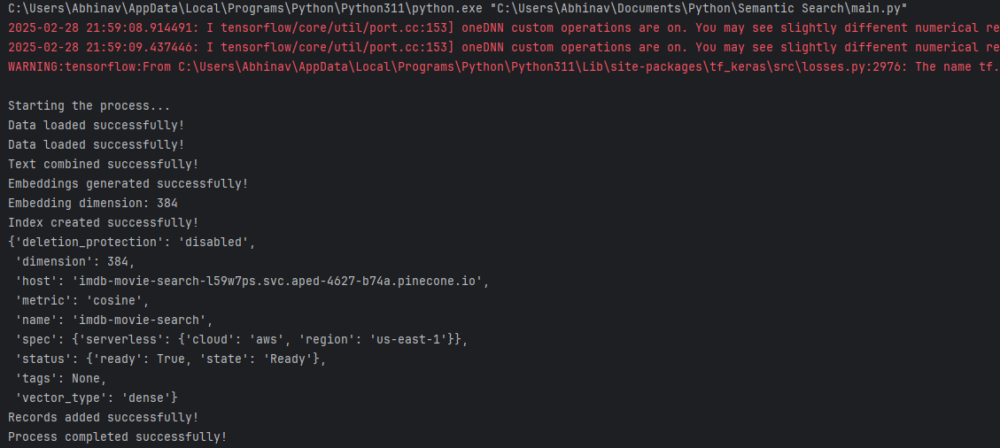

# IMDB Movies Semantic Search

This project is a semantic search application for the IMDB Movies dataset. It uses Streamlit for the web interface, Pinecone for vector database, and Sentence Transformers for text embeddings.

## Prerequisites

- Python 3.7+
- [Streamlit](https://streamlit.io/)
- [Pinecone Client](https://github.com/pinecone-io/pinecone-python-client)
- [Sentence Transformers](https://www.sbert.net/)
- [Pandas](https://pandas.pydata.org/)
- [NumPy](https://numpy.org/)

## Installation

1. Install the required packages:

    ```sh
    pip install -r requirements.txt
    ```
    Or install packages manually:
    ```sh
   pip install streamlit pinecone-client sentence-transformers pandas numpy
    ```

## Configuration
1. Pinecone Setup:
   * Sign up for a Pinecone account and obtain your API key.
   * Update the API key and environment details in your code (e.g., in app.py or a separate configuration file).
2. Dataset:
   * Download the IMDB movies dataset from Kaggle [link](https://www.kaggle.com/datasets/harshitshankhdhar/imdb-dataset-of-top-1000-movies-and-tv-shows).
   * Ensure that the dataset is available at the path specified in your text embedding module (or update the path accordingly).
## Running the Application

1. Ensure the vector DB is created in pinecone if not run the main.py.
   
    ```sh
    python main.py
    ```

2. Run the Streamlit application:

    ```sh
    streamlit run app.py
    ```

3. Open your web browser and go to `http://localhost:8501` to access the application.

## Usage

- Enter a movie description in the search box to find similar movies from the IMDB dataset.
- The application will display a list of recommended movies based on the semantic similarity of the description.

## Project Structure

- `app.py`: Main application file.
- `requirements.txt`: List of required Python packages.
- `text_embedding.py`: Contains the `Text_Processer` class for generating text embeddings.
- `pinecone_vector_db.py`: Contains the `PineconeVectorDB` class for interacting with the Pinecone vector database.

## App Images:


## console output:


